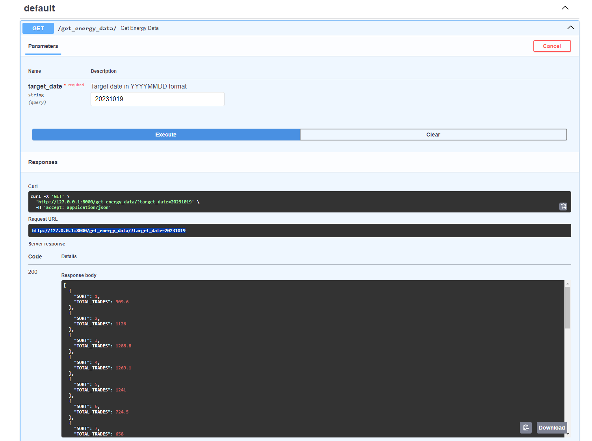

# energy-data-app
This is RESTful API that fetches, parses, and aggregates data from the specified XLSX file published on the enexgroup website.

It 

In order to use it, you will need:

1) Python 3.8+
2) FastAPI latest version
3) Uvicorn
4) Requests
5) Pandas
6) os

First, input your sorting filters in params.py. The run main.py and open http://127.0.0.1:8000/docs and write your date input on description field. (Like image bellow)

Alternate, open http://127.0.0.1:8000/get_energy_data/?target_date={date} and on date string, write your date.

